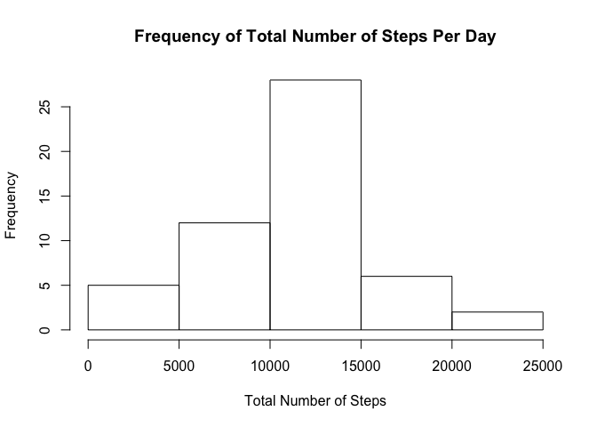
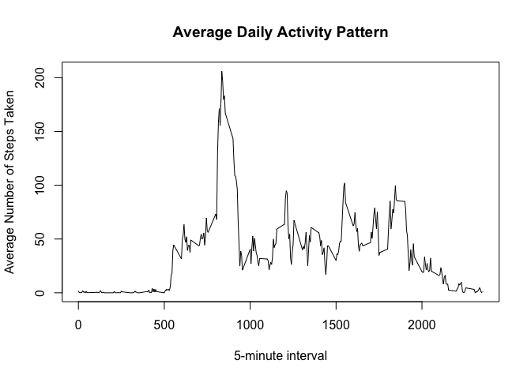
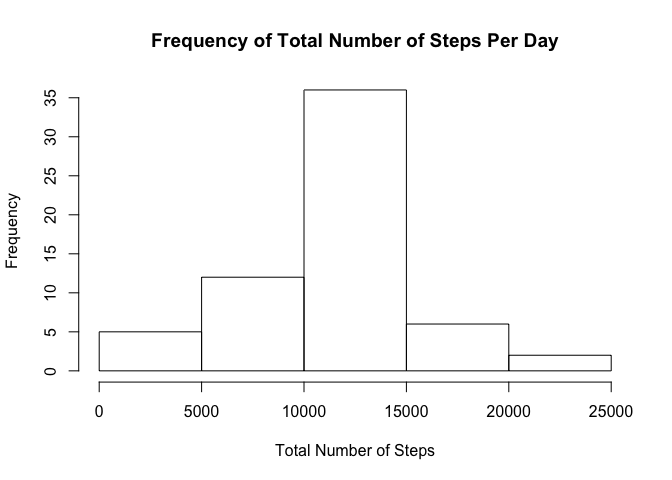
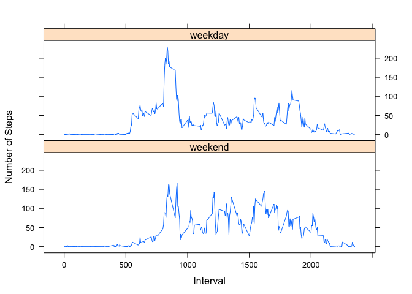

# Reproducible Research: Peer Assessment 1


## Loading and preprocessing the data

```r
activity <- read.csv("~/Desktop/Rep_Research/activity.csv")

completeActivity <- activity[complete.cases(activity),]
```

## What is the mean total number of steps taken per day?

```r
# Total number of steps taken per day.
totalSteps <- aggregate(completeActivity$steps, by=list(completeActivity$date), FUN=sum)


#histogram of the total steps
totalStepsHist <- hist(totalSteps$x,
                       main="Frequency of Total Number of Steps Per Day",
                       xlab="Total Number of Steps")
```

<!-- -->

```r
# Mean of total number of steps taken per day.
meanSteps <- mean(as.numeric(as.character(totalSteps$x)))

meanSteps
```

```
## [1] 10766.19
```

```r
# Median of total number of steps taken per day. 
medianSteps <- median(as.numeric(as.character(totalSteps$x)))

medianSteps
```

```
## [1] 10765
```

## What is the average daily activity pattern?

```r
# Total number of steps taken per day.
avgSteps <- aggregate(completeActivity$steps, by=list(completeActivity$interval), FUN=mean)

avgStepsPlot<- plot(avgSteps,
     type="l",
     xlab="5-minute interval",
     main="Average Daily Activity Pattern",
     ylab="Average Number of Steps Taken")
```

<!-- -->

```r
# Maximum number of steps
maxSteps<- max(avgSteps$x)

maxSteps
```

```
## [1] 206.1698
```

## Imputing missing values

```r
# Calculate and report the total number of missing values in the dataset (total number of rows with NAs)
naValues <- length(activity$steps[is.na(activity$steps)])

# Create a new dataset that is equal to the original dataset but with the missing data filled in.
# Replace NAs with mean for that 5-minute interval.
aggMeanSteps <- aggregate(completeActivity$steps, by=list(completeActivity$interval), FUN=mean)


for (i in 1:nrow(activity)){
  if (is.na(activity$steps[i])==TRUE){
    interval <- as.character(as.numeric(activity$date[i]))
    
    activity$steps[i] <- aggMeanSteps$x[as.numeric(as.character(aggMeanSteps$Group.1))==as.character(as.numeric(activity$interval[i]))]
  }
}

# Make a histogram of the total number of steps taken each day.
totalNonNaSteps <- aggregate(activity$steps, by=list(activity$date), FUN=sum)

totalNonNaStepsHist <- hist(totalNonNaSteps$x,
                       main="Frequency of Total Number of Steps Per Day",
                       xlab="Total Number of Steps")
```

<!-- -->

```r
# Mean total number of steps taken per day
meanNonNaSteps <- mean(as.numeric(as.character(totalNonNaSteps$x)))
meanNonNaSteps
```

```
## [1] 10766.19
```

```r
# Median total number of steps taken per day
medianNonNaSteps <- median(as.numeric(as.character(totalNonNaSteps$x)))
medianNonNaSteps
```

```
## [1] 10766.19
```
Median differs but mean does not differ. Removing NAs and replacing them with the mean of that interval increases the frequency of the means in the histogram. 

## Are there differences in activity patterns between weekdays and weekends?

```r
activity$date <- as.Date(activity$date)

weekdays <- c("Monday", "Tuesday", "Wednesday", "Thursday", "Friday")

weekend <- c("Saturday", "Sunday")


activity$wDay <- factor((weekdays(activity$date) %in% weekdays),
                        levels=c(FALSE,TRUE), labels= c("weekend", "weekday"))

avgNonNaSteps <- aggregate(activity$steps, by=list(activity$interval, activity$wDay), FUN=mean)

library(lattice)


names(avgNonNaSteps) <- c("interval", "wday", "steps")

xyplot(avgNonNaSteps$steps~avgNonNaSteps$interval | avgNonNaSteps$wday,
       layout=c(1,2), type="l",
       xlab="Interval", ylab="Number of Steps")
```

<!-- -->
